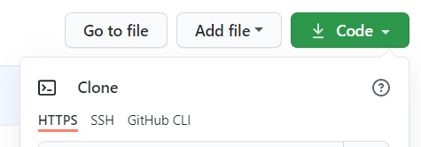

# 工具介绍
为什么要搭建博客呢？
因为作为一个（正在学习中的）开发者，我觉得这样比较酷！
我学习如何搭建博客主要参考的是[这篇博文](https://www.cnblogs.com/wxyww/p/xiaoshujiang.html)，写得很详细，感谢这位大佬的分享！
下面对要利用的这三个工具进行一下解释：

 1. **GitHub**： 利用github来进行搭建是因为**方便管理**，并且它免费。
 2. **GitBash**：帮助同步本地和远程仓库的工具。
 2. **Jekyll**：一般以github为基础来搭建博客会采用两种方案，一种是Hexo，另一种是Jekyll。在搜索各种教程的时候，查看到hexo需要安装nodejs，考虑到我的拖延症，和目前对前端知识一无所知的状态我选择了jekyll。
    [Jekyll网址](http://jekyllthemes.org/)
	这里可以找到一些jekyll的模板，不太爽的是正常情况下访问速度会比较慢，而且由于站长咕咕了，有些模板的demo无法预览。
 3. **小书匠**：一个可以绑定github仓库的Markdown编辑器，可以帮助我们在线更新博客~

# 准备工作
首先需要拥有一个GitHub的账号
申请成功后新建一个仓库，仓库的命名为：
**==username（你的账号名称）.github.io #F44336==**
在本地安装好GitBash工具，进行用户名和邮箱等的基础配置，这几步的操作有大量的网络教程可以参考~
这些工作做好后可以去[Jekyll网址](http://jekyllthemes.org/)或者其他的Jekyll模板的分享网站下载一个你喜欢的模板样式
找到了后下载下来，进行解压。为了将模板改成我们自己的博客，会前端语言的朋友们可以自由发挥，不是很明白的朋友可以先只修改 **_config.yml**这个文件里的内容，我是打开演示demo对着文件内容来进行匹配然后进行的修改。
# 开始搭建
首先在本地新建一个文件夹，用来作为本地仓库
用GitBash打开这个文件夹（本懒人一般直接右键Git Bash Here）
在你的GitHub仓库界面找到这个

复制https的地址，在gitbash的输入框内输入
``` cmd
$ git clone 复制的地址
```
这一步将你的github上的仓库克隆到了本地，你的本地文件夹中会出现一个和github仓库同名的文件夹，使用cd的方式进入到文件夹中。
将你下载好的模板文件放进文件夹里，建议直接放，不要在外面套文件夹。
接下来使用gitbash进行一系列操作，可以按我的顺序来：
``` cmd
$ git add . ::这一步是将所有文件（变化的文件）提交到暂存区
$ git commit -m "关于本次修改的注释" ::这一步是对你进行提交/修改的说明，一定要写，不然会影响到下一步的push

$ git push -u origin 分支名称 ::这一步就是提交了，要看清楚分支哦
```
基本上这几步没问题的话就提交成功了，在github的仓库里可以看到你上传的文件、目录
可以尝试访问
**username.github.io**
就可以看见你的博客啦！

到这里搭建就结束了，不会前端的朋友（比如我）可以在学习后慢慢对自己的博客进行修改~

# 利用Markdown编辑器在线更新博文
我用的是[小书匠](http://markdown.xiaoshujiang.com/)，在小书匠中绑定你的github仓库，提供授权的token就可以用小书匠编辑好文章直接保存在github仓库中啦！保存的时候注意保存在 **_posts**文件夹下，文件的命名格式要和模板中之前的文章一致
附上小书匠如何绑定的[说明文档](http://soft.xiaoshujiang.com/docs/tutorial/store/)

以上就是我搭建这个博客的全部过程，作为一个初学者，我也会慢慢让我的博客进化~
希望文章对你有所帮助！
